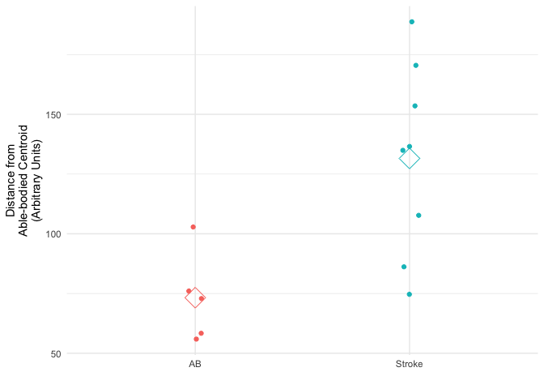
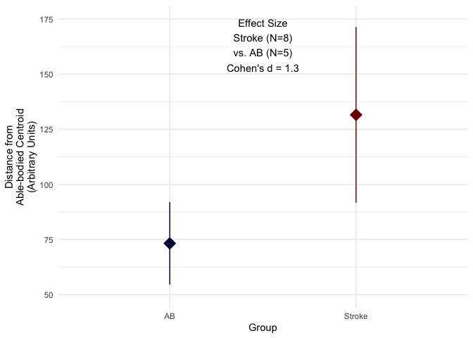
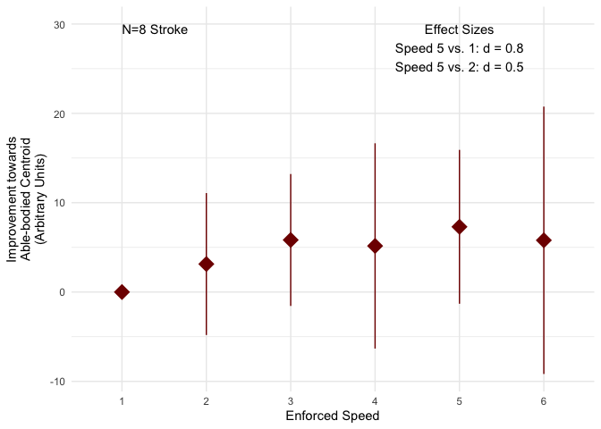
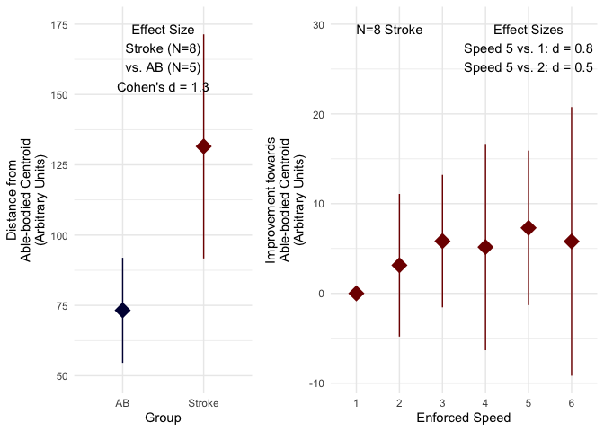

R01 Sample Size Justification
================
J. Lucas McKay
11/2/2021

## Data sources

This document is based on data from the file `GaitSignatureQuality.csv`
provided by Michael Rosenberg, Ph.D. This `.csv` file is not tracked by
github.

## Sample size justification

We powered the study based on preliminary gait quality data of N = 8
stroke survivors and N = 5 able-bodied comparison subjects. Across
groups, based on 1000 Welch Independent Samples t-tests simulated based
on preliminary data with a differential effect size of Cohen’s d = 1.3,
a sample size of N = 80 stroke survivors and N = 20 able-bodied
individuals will have &gt;99% power to resolve a difference between
stroke and able-bodied. Within the stroke group, based on contrasts
between gait quality measures obtained at enforced speed = 5 and
self-selected speed of Cohen’s d = 0.8, a paired-sample t-test will have
&gt;95% power to resolve an improvement in gait quality accompanying
increased gait speed. Further, based on observed contrasts between
enforced speed = 5 and enforced speed = 2 of Cohen’s d = 0.5, a
paired-sample t-test will have &gt;85% power to resolve differential
improvements in gait quality between enforced speeds 5 and 2.

## Figures

The primary multi-panel data figure is saved as `panels.eps`. The
arguments in the following line can be changed to alter its size and
resolution as needed.

    ggsave("panels.eps",plt,dpi=300,width=6.5,height=3,units="in")

## Simple group comparison figure

<!-- -->

## Annotated group comparison figure

<!-- -->

## Annotated speed comparison figure

<!-- -->

## Multi-panel figure

<!-- -->
